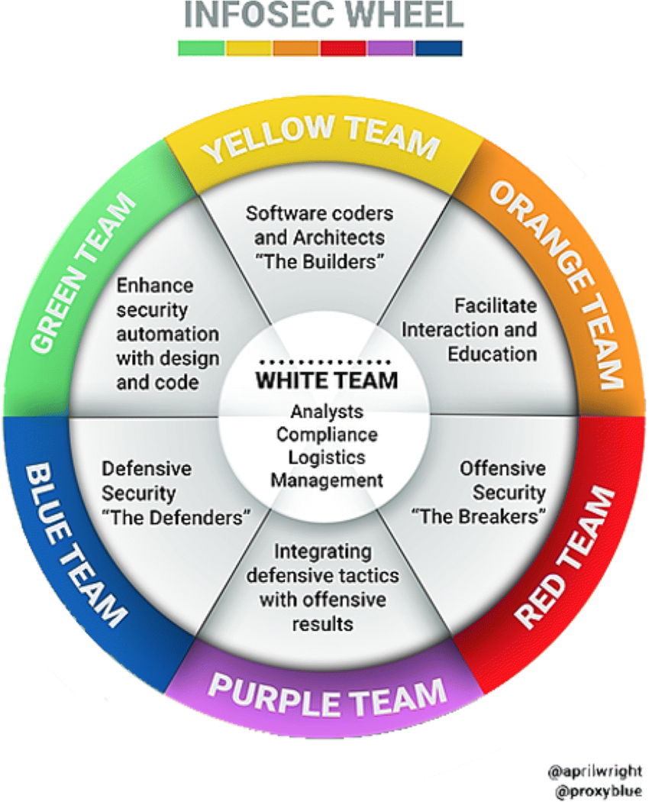

# Dominique Derrier | who0

| Officiellement      | Background |
| :----      | ----:  |
| 0x19 XP  | OpenSource |  
| Neotrust  |            |
| vCISO     | CTF Builder/runner  |
| iso27001 & NIST | ESP32, Docker, Vim |

# Pierre Le Calvez | Pedro

| Officiellement      | Background |
| :----      | ----:  |
| 0x14 XP   |  ex-Pentester 💀|  
| CGI       |  Incident Response enthusias 💣|
| Vice-Président Cybersécurité     |  Amateur Mountain Climber 🏔 & Skimo Fan ⛷️ |
|           |   |

# Disclaimer

👉 Les histoires sont toutes vraies ; 
👉 C’est drôle mais on ne se moque pas ; 
👉 On se veut bienveillant ; 
👉 On peut apprendre de l'erreur des autres ; 
👉 Attention certaines sections sont NSFW ; 
👉 Aucun #LLM n'a pas été maltraité durant la production de ces slides. 

# Participez

<iframe src='https://directpoll.com/r?XDbzPBdEt8j1rJIl2e4lyuRmUg823TAB4mZoxVhV3T0XHbG'> </iframe>

# La fraude téléphonique ☎️

Une compagnie vous appelle pour de l'aide pendant une fraude téléphonique. En effet, elle s'est rendu compte de la mise en place d'une redirection téléphonique vers un numéro surtaxé (que vous maîtrisez). 
Le client a déjà subi 20 000 $ de fraude pendant le week-end et vous demande un devis pour l'aider.

# La fraude téléphonique ☎️

<iframe src='https://directpoll.com/r?XDbzPBdJ2bAX0ZEKhkamRtcOaCiw1lOC7miHUsDeJlVoWzWI'></iframe>

# Shit in the fan 

Le patching... une histoire d'amour entre les Rouge, les Bleus, White. Pour des raisons de repotring, le gestionnaire de projets à eu accés à l'insterface de patching.

# Shit in the fan

<iframe src='https://directpoll.com/r?XDbzPBdJ3cBY1aFLilbnSudPbDjx2mPD8njIVtEfKmWpX0XJ'></iframe>

# Le Blackberry

Mais où sont jeté les anciens téléphones ? Dans les poubelles bien sûr... 
Et à votre avis … dans un telephone il y a quoi ?.

# Le Blackberry

<iframe src='https://directpoll.com/r?XDbzPBdJ4dCZ2bGMjmcoTveQcEky3nQE9okJWuFgLnXqY1YK'></iframe>

# Ressource saturée
A la belle époque ou 21 et le 20 était la meilleure solution pour échanger de fichier.
Le monitoring sonne à 2h du matin.

# Ressource saturée

<iframe src='https://directpoll.com/r?XDbzPBdJ5eDa3cHNkndpUwfRdFlz4oRFAplKXvGhMoYrZ2ZL'></iframe>

# DeLock BitLocker GPO

Optimisation via GPO.
Chiffrement + dechiffrement tous les jours.

# DeLock BitLocker GPO

<iframe src='https://directpoll.com/r?XDbzPBdJ6fEb4dIOloeqVxgSeGm05pSGBqmLYwHiNpZsa3aM'></iframe>

# Optimisation SSL
Les certificats SSL, le plaisir de l'administratif à l'installation. Pour simplifier les équipes ont décidé de faire des *.nomsdedomaine.com

# Optimisation SSL 

<iframe src='https://directpoll.com/r?XDbzPBdJ7gFc5eJPmpfrWyhTfHn16qTHCrnMZxIjOqatb4bN'></iframe>

# On the lan

La lettre de mandat est signée, le test est planifié, l'équipe lance la phase de reconnaissance dans l'entreprise. 
Comme c'est le premier test, l'équipe rouge sait qu'elle va trouver des surprises.

# On the lan

<iframe src='https://directpoll.com/r?XDbzPBdJ8hGd6fKQnqgsXziUgIo27rUIDsoNayJkPrbuc5cO'></iframe>

# Darknet
Le DarkNet, il parait qu'on peut trouver tout l'information du monde pour qui sait chercher. 
Rien de telle qu'un demo devant le pdg.

# Darknet

<iframe src='https://directpoll.com/r?XDbzPBdJ9iHe7gLRorhtY0jVhJp38sVJEtpObzKlQscvd6dP'></iframe>

# Mots de passe
Lors d'un pentest, l'idée est de recueillir un maximum de condensats de mots de passe pour en éprouver la solidité.  
C'est quoi le pire mot de passe que vous puissiez utiliser (et donc cracker)...

# Mots de passe

<iframe src='https://directpoll.com/r?XDbzPBdJAjIf8hMSpsiuZ1kWiKq49tWKFuqPc0LmRtdwe7eQ'></iframe>

# Pentest
Un pentest qui fonctionne bien, les gars sont rentrés et on dumpé un malware sur un serveur pour take down le domain.

# Pentest

<iframe src='https://directpoll.com/r?XDbzPBdJBkJg9iNTqtjva2lXjLr5AuXLGvrQd1MnSuexf8fR'></iframe>

# Le postit du président
Voute de mot de passe 

# Le postit du président

<iframe src='https://directpoll.com/r?XDbzPBdJ3gZuSeQCCLcEOIXV8EASrfcM4leMtLW6OxjFjAqUA'></iframe>

# Raid
A une époque ou les machines physiques étaient notre quotidien ... bien loin de la virtualsation, des containers et du cloud. Un disque tombe en failure ... appel du support, ouverture du care-pack.

# Raid

<iframe src='https://directpoll.com/r?XDbzPBdJ3havTfRDDMdFPJYW9FBTsgdN5mfNuMX7PykGkBrVB'></iframe>

# Le phishing

La sensibilisation par le phishing est l'un des premiers outils de sensibilisation marquants pour les équipes et les entreprises de toute taille qui utilisent l'informatique.  
 
Comment une sensibilisation par phishing peut-elle vraiment mal tourner ?

# Le phishing

<iframe src='https://directpoll.com/r?XDbzPBdJ3ibwUgSEENeGQKZXAGCUtheO6ngOvNY8QzlHlCsWC'></iframe>

# Nous aurions voulu...

<a href="https://starwarsintrogenerator.com/scroller?i=Ebot!vo!npoef!cjfo!sêfm%2F%2F%2F!qbt!tj!mpjoubjo!&t=Opt!ijtupjsft%0Ae‚fssfvst&e=Jm!fo!sftuf!fodpsf%2F&h=mft!%E2%80%A7!qbt!mf!ufnqt&p=D%28êubju!vo!uftu!ef!têdvsjuê!fo!dpoejujpot!sêfmmft%2F%0AKf!qfotbjt!rvf!mf!qbsf.gfv!cmprvfsbju!dfuuf!bdujwjuê!tvtqfduf%2F%0AK%28buufoebjt!mb!wbmjebujpo!ev!dibohfnfou!qbs!mf!dpnjuê!ef!têdvsjuê%2F%0AMf!dpssfdujg!êubju!fo!dpvst!ef!eêqmpjfnfou!rvboe!m%28jodjefou!t%28ftu!qspevju%2F%0AK%28bwbjt!nbm!dpnqsjt!mb!qpmjujrvf!ef!têdvsjuê%2F%0AMb!njtf!á!kpvs!b!qmbouê!fu!kf!o%28bj!qbt!fv!e%28bmfsuf%2F%0AKf!dspzbjt!rvf!mft!tbvwfhbseft!êubjfou!bvupnbujrvft%2F%0AMf!tdsjqu!ef!dpousõmf!o%28b!qbt!gpodujpooê!dpnnf!qsêwv%2F%0AKf!o%28bwbjt!qbt!mft!espjut!qpvs!dpssjhfs!mb!wvmoêsbcjmjuê%2F%0AMf!npu!ef!qbttf!qbs!eêgbvu!êubju!dfotê!ëusf!ufnqpsbjsf%2F%0AKf!dspzbjt!rvf!m%28boujwjsvt!bmmbju!eêufdufs!mb!nfobdf%2F%0AMf!sfeênbssbhf!ev!tfswfvs!efwbju!dpssjhfs!mf!qspcménf%2F%0AKf!o%28bj!qbt!sfèv!m%28bmfsuf!ef!têdvsjuê!á!ufnqt%2F%0AMb!epdvnfoubujpo!of!nfoujpoobju!qbt!dfuuf!dpogjhvsbujpo!dsjujrvf%2F%0AMb!uãdif!êubju!qmbojgjêf-!nbjt!fmmf!o%28b!kbnbjt!eênbssê%2F%0AKf!qfotbjt!rvf!mb!tfhnfoubujpo!sêtfbv!tvggjtbju!á!qspuêhfs!m%28bddét%2F%0AMf!dfsujgjdbu!TTM!êubju!fyqjsê!tbot!opujgjdbujpo%2F%0AKf!tvjwbjt!mft!jotusvdujpot!ef!m%28bodjfo!qspdfttvt%2F%0AMb!dpogjhvsbujpo!qbs!eêgbvu!tfncmbju!têdvsjtêf%2F%0AMb!tpmvujpo!ef!npojupsjoh!o‚b!sjfo!tjhobmê!e%28bopsnbm%2F%0APo!qfvu!qbt!qbudifs-!mf!xfcnbtufs!ftu!eêdêeê%2F%0AMf!uvup!ZpvUvcf!o%28êubju!qbt!mf!cpo%0AK%28bj!kvtuf!qspqbhê!mf!Wmbo%0AKf!u%28bwbjt!eju!rvf!mf!dbcmf!qbttbju!ebot!df!nvs%2F&s=15" style="color:white" >Ne pas clicker ici ! </a>

# Le mot de la fin ...

Même si 
 
 👉  l’amélioration continue ;  
 👉  l'intelligence artificielle ;  
 
 
 
Les questions de sécurité ne vont pas disparaitre et les erreurs humaines ne vont pas s’arrêter. 
Si l'on ne veut pas continuer à apprendre de ses erreurs, une dose d'humour dans l'amélioration continue est nécessaire pour avancer.

<!-- C

🕹️ INSERT COIN 
Mot de passe (Pierre)
Mise à jour (Dominique)
Droit d'admin (Dominique)
Mais il y a quoi sur le réseau ? (Pierre)
Prod Toujours (Dominique)

⚠️ WARNING! LOW HEALTH 
La fraude téléphonique (Pierre)
Mysql piraté (Dominique)
RM /save (Dominique)
Déclarer ou pas Déclarer (Pierre)
MDR Team (Dominique)

💀 GAME OVER (Quand tout part en vrille)
Gestion d’incident (Dominique)
Le Blackberry Perdu (Pierre)
Recovery (Dominique)
Le phishing (Pierre)

--> 
