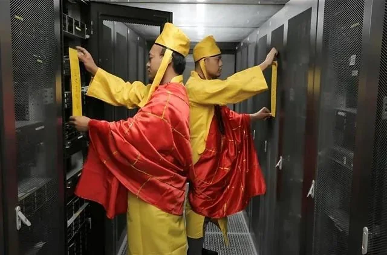
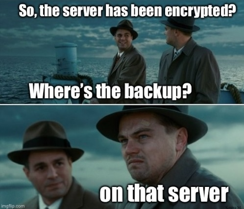
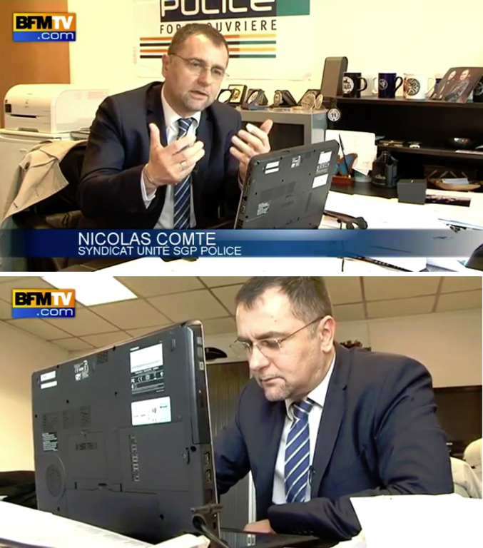
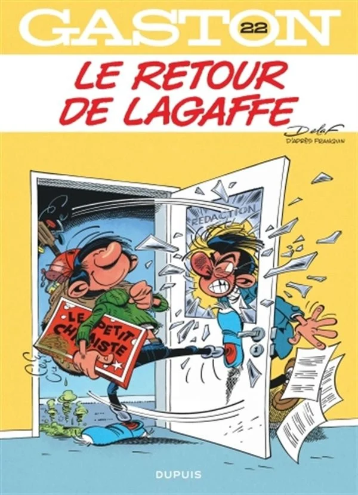
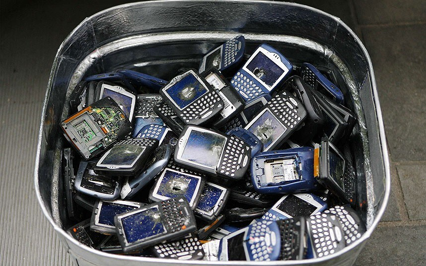
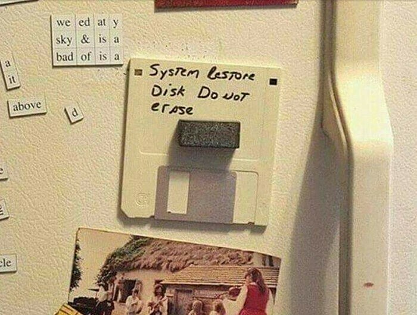
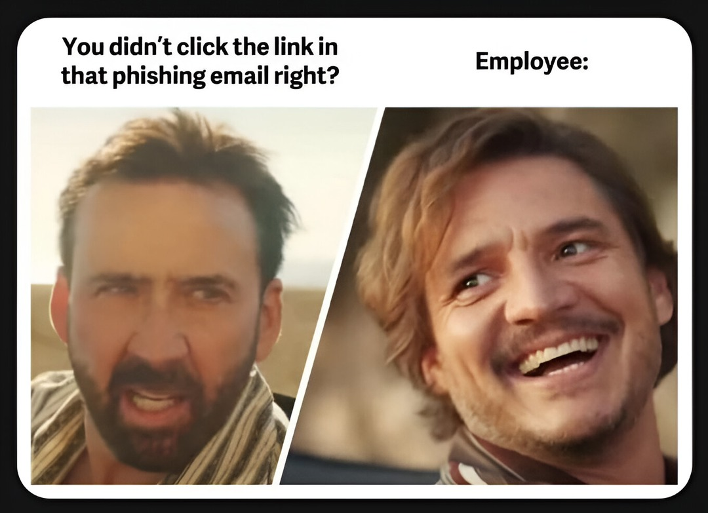

# Dominique Derrier

| Officiellement      |  |
| :----      | ----:  |
| 0x19 XP  | OpenSource |  
| Neotrust  |  Rubick         |
| vCISO     | CTF Builder/runner  |
| iso27001 & NIST | ESP32, Docker, Vim |

# Pierre Le Calvez 

| Officiellement      | ... |
| :----      | ----:  |
| 0x14 XP   |  ex-Pentester 💀|  
| CGI       |  Incident Response enthusias 💣|
| Vice-Président Cybersécurité     |  Amateur Mountain Climber 🏔 |
|           |  & Skimo Fan ⛷️  |

# Disclaimer

👉 Les histoires sont toutes vraies ; 
👉 C’est drôle mais on ne se moque pas ; 
👉 On se veut bienveillant ; 
👉 On peut apprendre de l'erreur des autres ; 
👉 Attention certaines sections sont NSFW ; 
👉 Aucun ChatGPT n'a pas été maltraité durant la production de ces slides. 

# Au Menu

 La base 
 En crise 
 On l'a échappé 

# Participez

<iframe src=https://directpoll.com/r?XDbzPBdJqE7S0CykN2frrEVSa8DvitiaQywbH3Ii9LEmTgK7f7 > </iframe>

# La base

Les bases indispensables ...

# Mot de passe

Lors d'un pentest, l'idée est de recueillir un maximum de condensats de mots de passe pour en éprouver la solidité.  
C'est quoi le pire mot de passe que vous puissiez utiliser (et donc cracker)...

# Mot de passe

<iframe sandbox="allow-same-origin allow-scripts allow-forms allow-presentation	"  src=https://directpoll.com/r?XDbzPBdJ2bAX0ZExqFfhpJ1IwhdFhJ40mWP7e6Hr9iU0UvbFv > </iframe>

# Mise à jour

Le monitoring, MRTG, PRTG, Zabbix, Datadog, Prometheus... Il existe des milliers d’outils pour avoir une visibilité essentielle afin de traiter et d'aider à la gestion des incidents. La mise à jour est nécessaire pour garder une gestion optimale.

# Mise à jour

<iframe data-slide-id=2 src=https://directpoll.com/r?XDbzPBdJ3cBY1aFyrGgiqK2JxieGiK51nXQ8f7IsAjV1VwcGw > </iframe>

# Droit d'admin

Grosse activité sur le réseau d'administration, celui qui n'est pas connecté à Internet mais il permet de relier l'entrerprise à tous ses clients. Le firewall a le CPU dans le tapis. Il y a trop de drops dans les logs qui saturent le CPU.

# Droit d'admin

<iframe data-slide-id=3 src=https://directpoll.com/r?XDbzPBdJ4dCZ2bGzsHhjrL3KyjfHjL62oYR9g8JtBkW2WxdHx > </iframe>

# Sur Le réseau

La lettre de mandat est signée, le test est planifié, l'équipe lance la phase de reconnaissance dans l'entreprise. 
Comme c'est le premier test, l'équipe rouge sait qu'elle va trouver des surprises.

# Sur Le réseau

<iframe data-slide-id=4 src=https://directpoll.com/r?XDbzPBdJ5eDa3cH0tIiksM4LzkgIkM73pZSAh9KuClX3XyeIy > </iframe>

# Prod Toujours

Le client qui effectue une loterie quotidienne avec 100 000 utilisateurs doit avoir une mise à jour.  
La mise à jour a été lancée sur le système.  
A priori, le CAB n’a pas été bien réalisé... Évidemment, la machine n’a pas redémarré.  
Et comme un incident n'arrive jamais seul, La procédure de rollback n’a pas été écrite.

# Prod Toujours

<iframe data-slide-id=5 src=https://directpoll.com/r?XDbzPBdJ6fEb4dI1uJjltN5M0lhJlN84qaTBiALvDmY4YzfJz > </iframe>

# En crise

Les menaces et incidents à surveiller (ou pas)

# Fraude Telephonique

Une compagnie vous appelle pour l'aider pendant une fraude téléphonique. En effet, elle s'est rendu compte de la mise en place d'une redirection téléphonique vers un numéro surtaxé (que vous maîtrisez). 
Le client a déjà subi 20 000 $ de fraude pendant le week-end et vous demande un devis pour l'aider.

# Fraude Telephonique

<iframe data-slide-id=6 src=https://directpoll.com/r?XDbzPBdJ7gFc5eJ2vKkmuO6N1miKmO95rbUCjBMwEnZ5Z0gK0 > </iframe>

# Mysql

Erreur d’indisponibilité sur un serveur client à forte consultation : la base ne répond plus à la même heure chaque jour. Cela fait plusieurs jours que cela dure.

# Mysql

<iframe data-slide-id=7 src=https://directpoll.com/r?XDbzPBdJ8hGd6fK3wLlnvP7O2njLnPA6scVDkCNxFoa6a1hL1 > </iframe>

# Rm /save

Pour aller plus vite les administrateurs sont créatifs à faire des raccoucis pour fluidifier leur gestion. 
Un admin a fait : ln –s /opt/database/ /osave   
Quelques jours plus tard pour faire le ménage un autre a fait : rm /osave/*  

# Rm /save

<iframe data-slide-id=8 src=https://directpoll.com/r?XDbzPBdJ9iHe7gL4xMmowQ8P3okMoQB7tdWElDOyGpb7b2iM2 > </iframe>

# Déclarer ou pas Déclarer

On arrive le lundi matin et il n'y a plus rien qui fonctionne...<b>C'est le drame</b>...  
On nous demande une rançon.  
La totalité des fichiers de l'entreprise est chiffrée et, pour les récupérer, il faut payer.  
Alors, que fait-on ?

# Déclarer ou pas Déclarer 

<iframe data-slide-id=9 src=https://directpoll.com/r?XDbzPBdJAjIf8hM5yNnpxR9Q4plNpRC8ueXFmEPzHqc8c3jN3 > </iframe>

# MDR Team

L’équipe utilise une équipe de réponse pour traiter les incidents, un service coûtant plusieurs milliers de dollars par mois. Ils remontent des alertes et déclenchent le plan d’escalade...  
Mais il est impossible de trouver les traces.

# MDR Team

<iframe data-slide-id=10 src=https://directpoll.com/r?XDbzPBdJBkJg9iN6zOoqySAR5qmOqSD9vfYGnFQ0Ird9d4kO4 > </iframe>

# On l'a échappé

Quand tout part en vrille

# Gestion d’incident

Incident arrive, c’est dans la douleur qu’on apprend le plus vite… et c’est moins le fun.
Intervention chez un client c’est parti pour organiser, mais il manque quelques éléments.

# Gestion d’incident

<iframe data-slide-id=11 src=https://directpoll.com/r?XDbzPBdJ3gZuSeQCpU7JJgxu2afNALA2sQO3jVkAbngEv8mZ7Z > </iframe>

# Le Blackberry perdu

Mais où sont jeté les anciens téléphones ? Dans les poubelles bien sûr... 
Et à votre avis … dans un telephone il y a quoi ? 

# Le Blackberry perdu

<iframe data-slide-id=12 src=https://directpoll.com/r?XDbzPBdJ3havTfRDqV8KKhyv3bgOBMB3tRP4kWlBcohFw9na8a > </iframe>

# Recovery

L’accident est malheureusement arrivé, il devait arriver car il n’y avait pas de patch, un musée archéologique. 
Confinement, éradication et récupération. 

C’est le moment de vérifier où sont les sauvegardes... et les retrouver : Mais.

# Recovery

<iframe data-slide-id=13 src=https://directpoll.com/r?XDbzPBdJ3ibwUgSErW9LLizw4chPCNC4uSQ5lXmCdpiGxAob9b > </iframe>

# Phishing

La sensibilisation par le phishing est l'un des premiers outils de sensibilisation marquants pour les équipes et les entreprises de toute taille qui utilisent l'informatique.  
 
Comment une sensibilisation par phishing peut-elle vraiment mal tourner ?

# Phishing

<iframe data-slide-id=14 src=https://directpoll.com/r?XDbzPBdJ3jcxVhTFsXAMMj0x5diQDOD5vTR6mYnDeqjHyBpcAc > </iframe>

# Nous aurions voulu...

<a href="https://starwarsintrogenerator.com/scroller?u=274rlxcl" style="color:white" >Ne pas clicker ici !</iframe>

# Le mot de la fin ...

Même si 
 
 👉  l’amélioration continue ;  
 👉  l'intelligence artificielle ;  
 
 
 
Les questions de sécurité ne vont pas disparaitre et les erreurs humaines ne vont pas s’arrêter. 
Si l'on ne veut pas continuer à apprendre de ses erreurs, une dose d'humour dans l'amélioration continue est nécessaire pour avancer.

# Questions
## 

<!-- C

🕹️ INSERT COIN 
Mot de passe (Pierre)
Mise à jour (Dominique)
Droit d'admin (Dominique)
Mais il y a quoi sur le réseau ? (Pierre)
Prod Toujours (Dominique)

⚠️ WARNING! LOW HEALTH 
La fraude téléphonique (Pierre)
Mysql piraté (Dominique)
RM /save (Dominique)
Déclarer ou pas Déclarer (Pierre)
MDR Team (Dominique)

💀 GAME OVER (Quand tout part en vrille)
Gestion d’incident (Dominique)
Le Blackberry Perdu (Pierre)
Recovery (Dominique)
Le phishing (Pierre)

--> 
